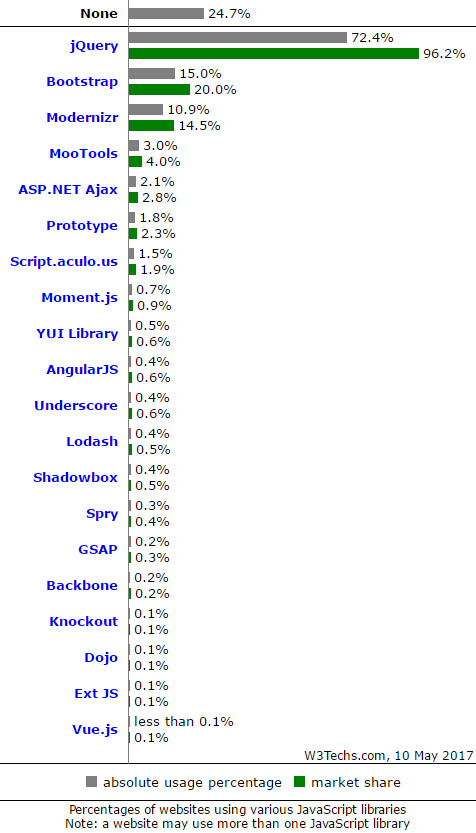
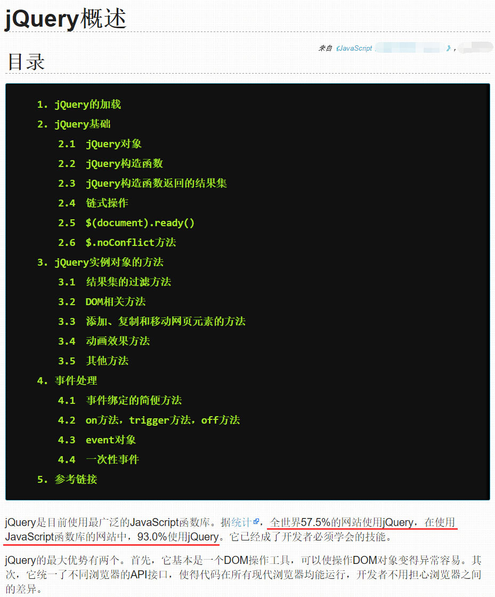

> 本课件参考:
>
> - [jQuery API 中文文档（官方）](https://www.jquery123.com/)
> - [jQuery API 中文文档（非官方）](http://jquery.cuishifeng.cn/)
> - [jQuery 菜鸟教程](http://www.runoob.com/jquery/jquery-tutorial.html)

# # jQuery 简介

jQuery是一套跨浏览器的 [JavaScript库](http://baike.sogou.com/lemma/ShowInnerLink.htm?lemmaId=1023011&ss_c=ssc.citiao.link)，简化HTML与JavaScript之间的操作。它是[轻量级](http://baike.sogou.com/lemma/ShowInnerLink.htm?lemmaId=7988600&ss_c=ssc.citiao.link)的js库 ，兼容[CSS3](http://baike.sogou.com/lemma/ShowInnerLink.htm?lemmaId=40562&ss_c=ssc.citiao.link)，还兼容各种浏览器，jQuery2.0及后续版本不再支持[IE6](http://baike.sogou.com/lemma/ShowInnerLink.htm?lemmaId=4794817&ss_c=ssc.citiao.link)/7/8浏览器。由John Resig在2006年1月的BarCamp NYC上发布第一个版本。目前是由 Dave Methvin 领导的开发团队进行开发。jQuery使用户能更方便地处理HTML documents、events、实现动画效果，并且方便地为网站提供AJAX交互。jQuery还有一个比较大的优势是，它的文档说明很全，而且各种应用也说得很详细，同时还有许多成熟的插件可供选择。jQuery能够使用户的html页面保持代码和html内容分离，也就是说，不用再在html里面插入一堆js来调用命令了，只需定义id即可。

# # 为什么使用jQuery

我们先来看这样一个全球网站使用框架（或库）统计的[数据](https://w3techs.com/technologies/overview/javascript_library/all)。



统计图表右下角是统计的时间：2017年5月10日。

从统计结果可以发现，虽然全球仍有24.7%的网站没有任何库或框架（包括只使用HTML+CSS和只使用HTML+CSS+JavaScript两种情况），在全部的参与统计的网站中有72.4%使用了jQuery，但只要使用了库或框架的网站96.2%的都选择了jQuery，这个数据相对于某知名网站在2013年12月28日统计的结果——全部网站57.5%的使用率和使用框架网站93.0%的使用率来讲，还有一定程度的增加。下面是该网站的部分截图：



从以上两个数据的对比完全击破近些年来互联网上流传的“jQuery已死”的“谣言”。对于一个这么好用，比较有“背景”，并且还在不断进步的JavaScript类库来讲怎么可能这么容易“死”。相信也只是某些库和框架团队为了挽回其产品使用率不高的局面，而创造的“段子”而已，我们只需要相信数据是不会撒谎的这个道理即可。

对于一个使用率如此之高，长期盘踞着互联网软件开发环境下No.1的库来说，我们没有理由不去学习。熟练地使用jQuery也是现在的互联网企业招聘前端开发的必备技能条件之一，如果一个开发者不会jQuery，那他和“前端工程师”这几个字是没有什么关系了。

# # jQuery 相关特点

jQuery包含以下特点：

- 动态特效
- ajax
- 通过插件来扩展
- 方便的工具 - 例如浏览器版本判断
- 渐进增强
- 链式调用
- 多浏览器支持，支持Internet Explorer6.0+、Opera9.0+、Firefox2+、Safari2.0+、Chrome1.0+（在2.0.0中取消了对Internet Explorer6,7,8的支持）

# # jQuery 优势

jQuery的座右铭是 “write less， do more.”，因为和传统的JavaScript相比，jQuery使得只需要使用更少的代码就可以完成同样的功能。jQuery具备以下优势：

- 简单的选择器/DOM操作
- 简化代码
- 跨浏览器兼容性

# # jQuery 与 JavaScript 的关系

简单地说，jQuery就是对JavaScript进行封装而出来的一个库。这和我们以前用JavaScript来写函数和方法，让一段段的语句有更强的可复用性和可维护性是一样的，只是jQuery把这件事情做得更加的极致了而已。

jQuery的原理就是用它自定的一个变量名“jQuery”作为对象名，然后再赋值给“*$*”这个变量，并且还提供了一个noConflict()方法回调来允许开发自定义变量名从而防止和其它框架库命名的冲突。

# # jQuery 版本选择

在jQuery的开发过程中，创建了大量的代码来支持IE6、7、8，从而使得脚本更大也更加复杂。因此当研发2.0版本的jQuery时，研发团队决定这个版本放弃对早期浏览器的支持，以便创建更小、更快的脚本。

不过，jQuery团队也考虑到，在网上仍然有很多用户使用这些早期的浏览器，因此开发者仍然需要去支持这些用户。出于这样的原因，他们保留了两个并行的jQuery版本：

- `jQuery 1.9+`：包含和2.0x同样的功能，不过依然支持IE6、7、8。
- `jQuery 2.0+`：放弃支持早期浏览器，使得脚本更小、更快。

这两个版本的功能在短期之内应该不会产生重要的区别。jQuery文件名中应该包含其版本号（比如，jquery-3.2.1.min.js 或 jquery-3.2.1.js）。如果不这样做的话，用户的浏览器可能会缓存更新或更旧版本的文件，从而可能导致脚本运行不正常。

# # jQuery 引入方式

## 1、在线引用

> [CDN 引用地址](http://www.bootcdn.cn/jquery/)

```html
<script src="https://cdn.bootcss.com/jquery/3.2.1/jquery.js"></script>
```

## 2、本地引用

点击前往 [jQuery 下载](http://jquery.com/download/)，选择第一项 *Download the compressed, development  jQuery 3.2.1*，保存到项目之后，直接引用这个文件即可。

> tips：最常用的jQuery基础方法是：`.ready()方法`
>
> ```javascript
> $(document).ready(function(){
> 	// insert javscript code here...
> });
> ```
>
> 或者其简写：
>
> ```javascript
> $(function(){
> 	// insert JavaScript code here...
> });
> ```
>
> 该方法的作用是文档就绪执行，当DOM加载完就可以执行（比 *window.onload* 更早）。在同一个页面里可以多次出现 `.ready()`。

## 3、npm 安装

通过npm下载最新版本的方式：

```shell
$ npm install [-g] jquery
```

下载指定版本（第1.x版的最新版本）：

```shell
$ npm install [-g] jquery@1
```

下载的jQuery文件夹包含在一个叫做“node_modules”的文件夹下。

# # jQuery/DOM 对象转换

jQuery 对象是通过 jQuery 包装DOM 对象后产生的对象。jQuery 对象是 jQuery 独有的，其可以使用 jQuery 里的方法，但是不能使用 DOM 的方法；例如：

````javascript
$("#img").attr("src","test.jpg")
````

这里的 `$("#img")` 就是 jQuery 对象。

DOM 对象就是Javascript 固有的一些对象操作。DOM 对象能使用Javascript 固有的方法，但是不能使用 jQuery 里的方法。例如：

```javascript
document.getElementById("img").src = “test.jpg";
```

这里的 *document.getElementById("img") ;*   就是DOM 对象。

*$("#img").attr("src","test.jpg");* 和 *document.getElementById("img").src = "test.jpg";*  是等价的，是正确的，但是 *$("#img").src = "test.jpg" ;*  或者 *document.getElementById("img").attr("src","test.jpg");* 都是错误的。

再说一个例子，就是 `this` , 在写 jQuery 时经常这样写：*this.attr("src","test.jpg");* 可是就是出错，其实 `this` 是DOM对象，而 *.attr("src","test.jpg")* 是 jQuery 方法，所以出错了。要解决这个问题就要将 DOM对象转换成 jQuery 对象，例如 *$(this).attr("src","test.jpg");*

## 1、DOM 对象转成 jQuery 对象

对于已经是一个 DOM 对象，只需要用 `$()` 把DOM对象包装起来，就可以获得一个 jQuery 对象了，$(DOM 对象)。

```javascript
let domObj    = document.getElementById('img');
let jqueryObj = $(domObj);
```

转换后，就可以任意使用 jQuery 的方法。

## 2、jQuery 对象转成 DOM 对象

将 jQuery 对象转换为 DOM 对象的方式主要有两种：[index] 和 .get(index)；

- jQuery 对象是一个数据对象，可以通过 [index] 的方法，来得到相应的 DOM 对象：

```javascript
// jQuery 对象
let $div = $('#div'); 
// DOM 对象
let div  = $div[0];
```

- jQuery 本身提供，通过.get(index) 方法得到相应的 DOM 对象：

```javascript
// jQuery 对象
let $div = $('#div'); 
// DOM 对象
let div  = $div.get(0);
```

通过以上方法，可以任意的相互转换 jQuery 对象和 DOM 对象，需要再强调的是： DOM 对象才能使用DOM 中的方法，jQuery 对象是不可以使用DOM中的方法。

# # jquery 防止其它库冲突

我们知道，变量的命名可以以英文字母、下划线和$符开头。英文字符的命名容易产生重名，下划线美观度又不够。所以很多编程语言，以至于很多JS框架或库都喜欢用“$”符来作为变量名，jQuery就是其中的“著名代表”。这样一来就造成一个问题，如果一个项目中若采用多种第三方的插件、框架和类库难免会产生“$”名称的冲突，而使用“jQuery”这个默认对象作为名称书写起来又比较麻烦，且容易写错。为了解决这个问题，jQuery使用了一个 `noConflict()` 方法来让开发者可以自定义jQuery对象（$对象）的名称。

```javascript
// 将“$“对象的名称改为”jq“
var jq = $.noConflict();
jq("li").click(function(){
  	var txt = jq(this).text();
  	jq("p").text(text);
});
```

这样一来我们就可以使用“jq”作为我们全局的jQuery对象名了。但若我们开发的项目只使用了jQuery这个库，或者使用的其它第三方程序与jQuery没有名称上的冲突，那是完全没有必要这要做的。毕竟技术的一些关键名称会形成开发者的一些习惯，也是团队间无声的交流语言。如果只是图一个个性，把这个名字改了，只会给团队开发造成一些不必要的困扰。

=