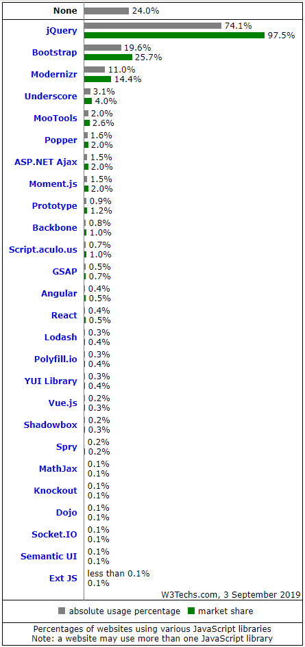
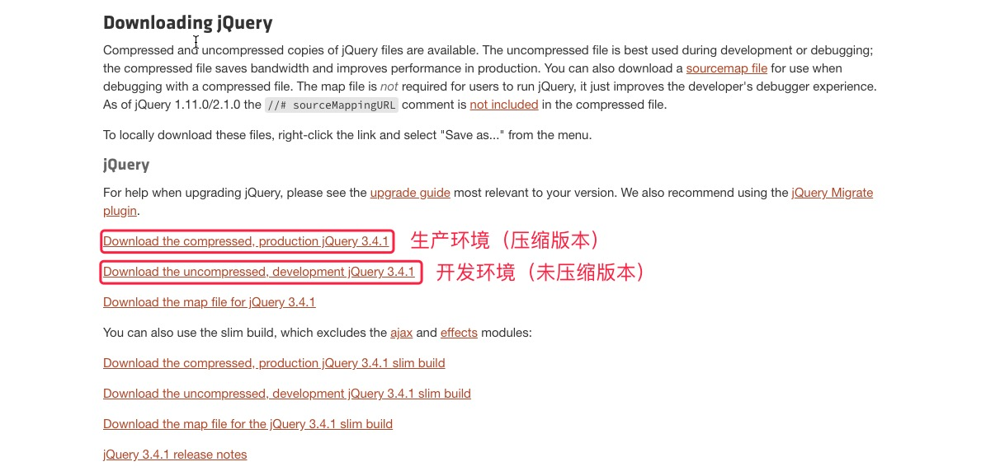

> 本课件参考:
>
> - [jQuery API 中文文档（官方）](https://www.jquery123.com/)
> - [jQuery API 中文文档（非官方）](http://jquery.cuishifeng.cn/)
> - [jQuery 菜鸟教程](http://www.runoob.com/jquery/jquery-tutorial.html)

# 一、jQuery 简介

jQuery是一套跨浏览器的 [JavaScript库](http://baike.sogou.com/lemma/ShowInnerLink.htm?lemmaId=1023011&ss_c=ssc.citiao.link)，简化HTML与JavaScript之间的操作。它是[轻量级](http://baike.sogou.com/lemma/ShowInnerLink.htm?lemmaId=7988600&ss_c=ssc.citiao.link)的js库 ，兼容[CSS3](http://baike.sogou.com/lemma/ShowInnerLink.htm?lemmaId=40562&ss_c=ssc.citiao.link)，还兼容各种浏览器，jQuery2.0及后续版本不再支持[IE6](http://baike.sogou.com/lemma/ShowInnerLink.htm?lemmaId=4794817&ss_c=ssc.citiao.link)/7/8浏览器。由 `John Resig` 在2006年1月的BarCamp NYC上发布第一个版本。目前是由 Dave Methvin 领导的开发团队进行开发。jQuery使用户能更方便地处理HTML documents、events、实现动画效果，并且方便地为网站提供 Ajax 交互。jQuery还有一个比较大的优势是，它的文档说明很全，而且各种应用也说得很详细，同时还有许多成熟的插件可供选择。jQuery能够使用户的html页面保持代码和html内容分离，也就是说，不用再在html里面插入一堆js来调用命令了，只需定义id即可。

# 二、为什么使用jQuery

我们先来看这样一个全球网站使用框架（或库）统计的 [数据](https://w3techs.com/technologies/overview/javascript_library/all)。



统计图表右下角是统计的时间：2019年9月3日。

# 三、jQuery 相关特点

jQuery包含以下特点：

- 动态特效
- ajax
- 通过插件来扩展
- 方便的工具 - 例如浏览器版本判断
- 渐进增强
- 链式调用
- 多浏览器支持，支持Internet Explorer6.0+、Opera9.0+、Firefox2+、Safari2.0+、Chrome1.0+（在2.0.0中取消了对Internet Explorer6,7,8的支持）

# 四、jQuery 优势

jQuery的座右铭是 “write less， do more.”，因为和传统的JavaScript相比，jQuery使得只需要使用更少的代码就可以完成同样的功能。jQuery具备以下优势：

- 简单的选择器/DOM操作
- 简化代码
- 跨浏览器兼容性

# 五、jQuery 与 JavaScript 的关系

简单地说，jQuery就是对JavaScript进行封装而出来的一个库。这和我们以前用JavaScript来写函数和方法，让一段段的语句有更强的可复用性和可维护性是一样的，只是jQuery把这件事情做得更加的极致了而已。

jQuery的原理就是用它自定的一个变量名“jQuery”作为对象名，然后再赋值给“*$*”这个变量，并且还提供了一个noConflict()方法回调来允许开发自定义变量名从而防止和其它框架库命名的冲突。

# 六、jQuery 版本选择

在jQuery的开发过程中，创建了大量的代码来支持IE6、7、8，从而使得脚本更大也更加复杂。因此当研发2.0版本的jQuery时，研发团队决定这个版本放弃对早期浏览器的支持，以便创建更小、更快的脚本。

不过，jQuery团队也考虑到，在网上仍然有很多用户使用这些早期的浏览器，因此开发者仍然需要去支持这些用户。出于这样的原因，他们保留了两个并行的jQuery版本：

- `jQuery 1.9+`：包含和2.0x同样的功能，不过依然支持IE6、7、8。
- `jQuery 2.0+`：放弃支持早期浏览器，使得脚本更小、更快。

这两个版本的功能在短期之内应该不会产生重要的区别。jQuery文件名中应该包含其版本号（比如，jquery-3.2.1.min.js 或 jquery-3.2.1.js）。如果不这样做的话，用户的浏览器可能会缓存更新或更旧版本的文件，从而可能导致脚本运行不正常。

# 七、jQuery 引入方式

## 1、在线引用

> [CDN 引用地址](http://www.bootcdn.cn/jquery/)

```html
<script src="https://cdn.bootcdn.net/ajax/libs/jquery/3.6.0/jquery.js"></script>
```

## 2、本地引用

>  [官网下载](http://jquery.com/download/)



选择对应的版本，`ctr + S` 保存。然后再页面中引入即可：

```html
<script src="./js/jquery-3.4.1.js"></script>
<script src="./js/index.js"></script>
```

## 3、包管理工具下载

```shell
$ npm i -s jquery
$ yarn add -s jquery
```

下载指定版本（第1.x版的最新版本）：

``` 
$ npm i -s jquery@1.9
```

下载的jQuery文件夹包含在一个叫做“node_modules”的文件夹下。

## 4、文档就绪

```js
$(window).ready(function() {

})
$(function() {
    
})
```

# 八、对象转换

```html
<h1 class="title">Hello, jQuery!</h1>
```

我们看看原生JavaScript和jquery获取h1标签的形式：

```javascript
// 1. 原生JavaScript获取元素
let title = document.querySelector("#title");
console.log(title.textContent); // Hello, jQuery!
// 2. jQuery获取元素
let $title = $("#title");
console.log($title.text()); // Hello, jQuery!
```

可以看到，两种方法实现的效果都是一样的，但是明显jQuery的语法更加简洁。需要注意的是原生对像和jQuery对象是不相等的，所以有时我们需要将二者进行转换，转换方式如下：

```js
// 1. JavaScript对象转jQuery对象
$(title);
// 2. jQuery对象转JavaScript对象
$title[0];
$title.get(0);
```

# 九、jquery 防止冲突

我们知道，变量的命名可以以英文字母、下划线和$符开头。英文字符的命名容易产生重名，下划线美观度又不够。所以很多编程语言，以至于很多JS框架或库都喜欢用“$”符来作为变量名，jQuery就是其中的“著名代表”。这样一来就造成一个问题，如果一个项目中若采用多种第三方的插件、框架和类库难免会产生“$”名称的冲突，而使用“jQuery”这个默认对象作为名称书写起来又比较麻烦，且容易写错。为了解决这个问题，jQuery使用了一个 `noConflict()` 方法来让开发者可以自定义jQuery对象（$对象）的名称。

```javascript
// 将“$“对象的名称改为”jq“
var jq = $.noConflict();
jq("li").click(function(){
  	var txt = jq(this).text();
  	jq("p").text(text);
});
```

这样一来我们就可以使用“jq”作为我们全局的jQuery对象名了。但若我们开发的项目只使用了jQuery这个库，或者使用的其它第三方程序与jQuery没有名称上的冲突，那是完全没有必要这要做的。毕竟技术的一些关键名称会形成开发者的一些习惯，也是团队间无声的交流语言。如果只是图一个个性，把这个名字改了，只会给团队开发造成一些不必要的困扰。

# 十、插件
- [jQuery 之家 >>](<http://www.htmleaf.com/>)
- [jQuery 插件库 >>](<http://www.jq22.com/>)
